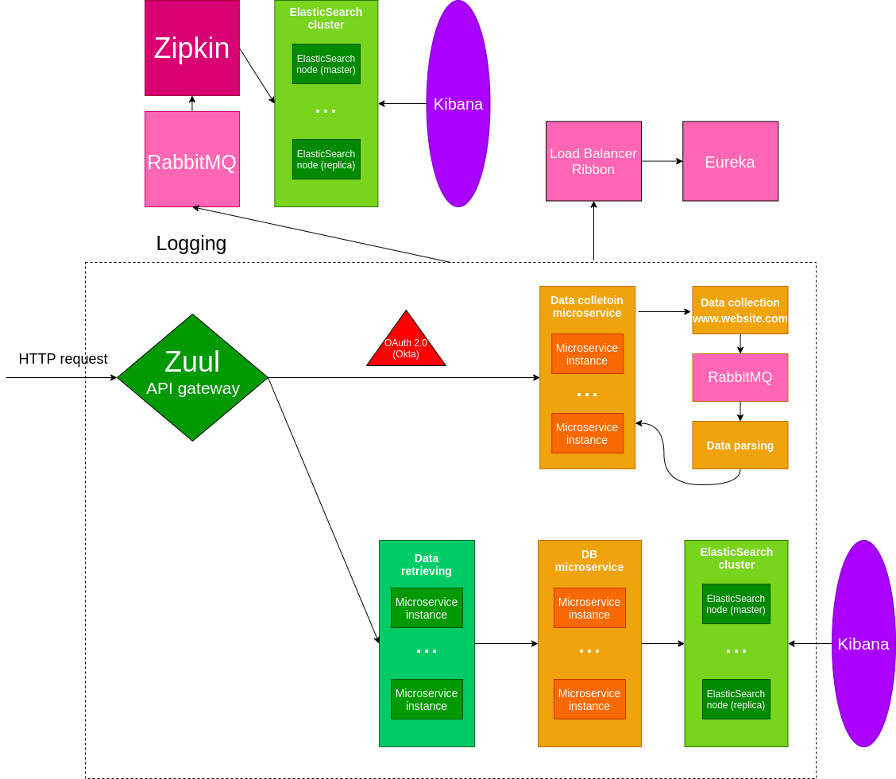

# appareldiving (in progress)

This application is designed to show well-seattled communication among a number of cloud technologies. How it will work:

Techlogoies used:
- Spring Cloud
- ElasticSearch
- Kibana
- RabbitMQ
- REST Architecture
- ...

### Ports

| Application  | Port | 
| ------------- | ------------- | 
| DataScrapingService  | 8000..8009  |
| AdidasDataParsingService  | 8010..8019  |
| Eureka server  | 8761  |
| Zuul Getaway  | 8765  |
| Zipkin Tracing System  | 9411  |

### Dev checklist

| Feature  | AdidasParsingService | AdidasScrapingService |
| ------------- | ------------- | ------------- |
| Set up port  | [X]  | [X] |
| Set up app name  | [X]  | [X] |
| Eureka client  | [X]  | [X] |
| Zull | []  | [] |
| RabbitMQ  | [] | [] |
| Zipkin  | []  | [] |
| Hystrix  | []  | [] |
| Exception handling  | [] | [] |
| Swagger  | []  | [] |

# Docker images:

# Possible problmes with running ElasticSearch and Kibana
1. Kibana server is not ready yet.
2. localhost:9200 (elastic) does not respond 
3. localhost:9200 (elastic) responds 503 or any other error code
4. curl -X GET "localhost" responds with "connection reset by peer"

## Solution
1. Increase amount of memory allocate for ElasticSearch and Kibana (~1.24Gb for elasticsearch image and ~500Mb for kibana). Basically, if there is no custom memory settings (--memory="XXXMb") is used, no issues should arise.

### ElasticSearch & Kibana
//ElasticSearch and Kibana have its own localhost being in container. However, if we put them in mutual network, it will woek fine for both.//
docker network create elastic

//In this project, single-node elasticsearch is used as there is no reason to consume more resources for development purposes. Also, elasticsearch:7.6.1 version is used.

docker run -d --name elasticsearch --net elastic -p 9200:9200 -p 9300:9300 -e "discovery.type=single-node" -e "http.host=0.0.0.0" -e "transport.host=0.0.0.0" -e "xpack.security.enabled=false" elasticsearch:7.6.1

docker run -d --name kibana --net elastic -p 5601:5601 kibana:7.6.1

### ElasticSearch index creation in linux bash:
curl -X PUT "localhost:9200/appareldiving?include_type_name=true&pretty" -H 'Content-Type: application/json' -d' { "settings": { "index": { "number_of_shards": 3, "number_of_replicas": 1 } }, "mappings": { "offer": { "properties": { "articleId": { "type": "integer" }, "offerId": { "type": "text" }, "price": { "type": "float" }, "salesPrice": { "type": "float" }, "color": { "type": "text" }, "orderable": { "type": "boolean" }, "productUrl": { "type": "text" }, "productImages": { "type": "text" } } } } }'

json---

{
    "settings" : {
        "index" : {
            "number_of_shards" : 3, 
            "number_of_replicas" : 1 
        }
    },
    "mappings" : {
        "offer" : {
            "properties" : {
                "articleId" : { "type" : "integer" },
                "productId" : { "type" : "text" },
                "price" : { "type" : "float" },
                "salesPrice" : { "type" : "float" },
                "color" : { "type" : "text" },
                "orderable" : { "type" : "boolean" },
                "productUrl" : { "type" : "text" },
                "productImages" : { "type" : "text" }
            }
        }
    }
}

----
## Redis

1. docker pull redis

2. docker run -it --name redis-server  -p 6379:6379 -d redis

3. docker container ls (just to make sure it works fine)

#### Additional configurations

data-retriever service: redis port:6379
data-parsing-adidas service: redis port:6380

## RabbitMQ

1. docker pull rabbitmq:3

2. docker run -it --name rabbitmq  -p 5672:5762 -d rabbitmq:3

3. docker container ls (just to make sure it works fine)

## Zipkin

1. docker pull openzipkin/zipkin

2. docker run -it --name zipkin-server -p 9411:9411 -d openzipkin/zipkin RABBIT_URI=localhost

3. docker container ls (just to make sure it works fine)
